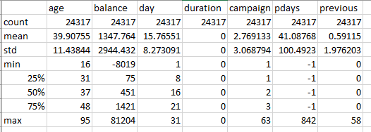

### Introduction
The purpose of this project is to develop a classifier that uses data to predict the outcome of a bank marketing campaign. This document provides a description of the steps taking in analysing and  cleaning the datasets used in the project, choosing a classifier and making predictions on the query set.

### Data Exploration
Before processing continuous and categorical features of the dataset independently, the entire training set was checked for null values and none were found, however the categorical features contain a large number of ‘unknown’ values. The id feature was also dropped, as it is useful only as an index.

The proportion of the categorical feature ‘y’, which is the result set of the training data, was also checked. It was show to have 88% ‘TypeA’ values. Given the irregular proportionality of the results set (88% TypeA), rows with result values of TypeA were undersampled to match the number of rows containing TypeB.

## Continuous Features
The continuous features of the dataset are age, balance, day, duration, campaign, pdays and previous. These features were separated from the main dataset to be analysed using the data quality report shown below. Boxplot graphs were also used to independently analyse the numerical data.

The data quality report shows that balance, campaign, pdays and previous have outliers, indicated by their max values skewing widely from the mean, given the standard deviation of each. Duration also clearly shows that every value contained within is 0. For this reason, the duration feature was dropped from the dataset.
The features balance, campaign, pdays and previous were all imputed to remove outliers. This was done by calculating the interquartile range (IQR) of each feature, and then removing any values that resided outside the range of 1st Quartile – (1.5*IQR) to 3rd Quartile + (1.5*IQR).

## Categorical Features
The categorical features of the dataset are job, marital, education, default, housing, loan, month, contact, poutcome. These features were separated from the main dataset to be analysed independently, primarily for identifying the proportion of unknown values in each feature.

The feature poutcome was shown to have over 80% unknown values, and as such was drop from the dataset. The default feature was shown to be disproportionally skewed towards “no” values, and for this reason it was also removed. Contact was shown to have 28% unknown values, and a number of other features showed smaller percentages of unknowns. These features were imputed by replacing any unknown values with the mode of that particular feature.
